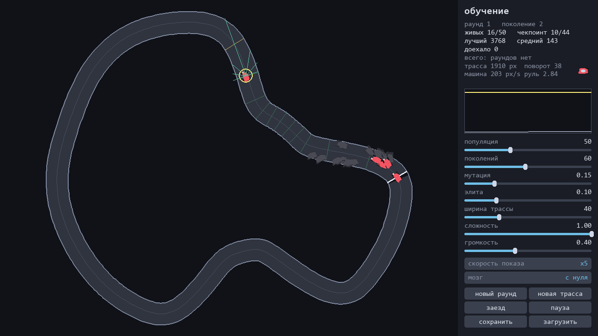
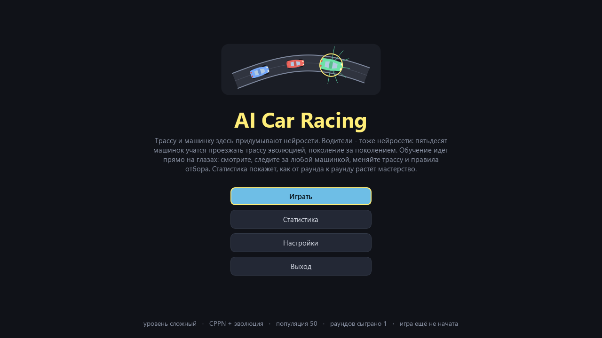
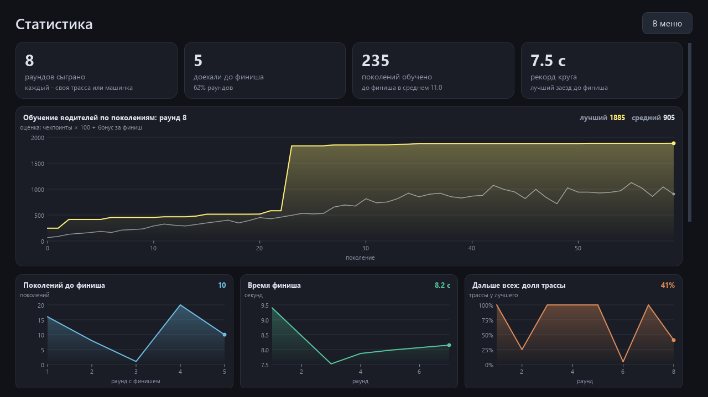
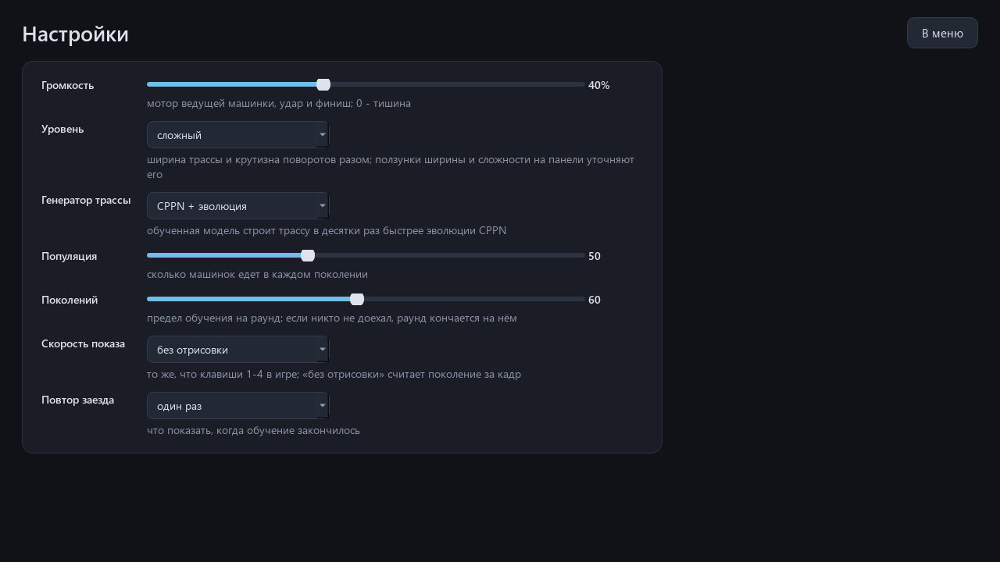
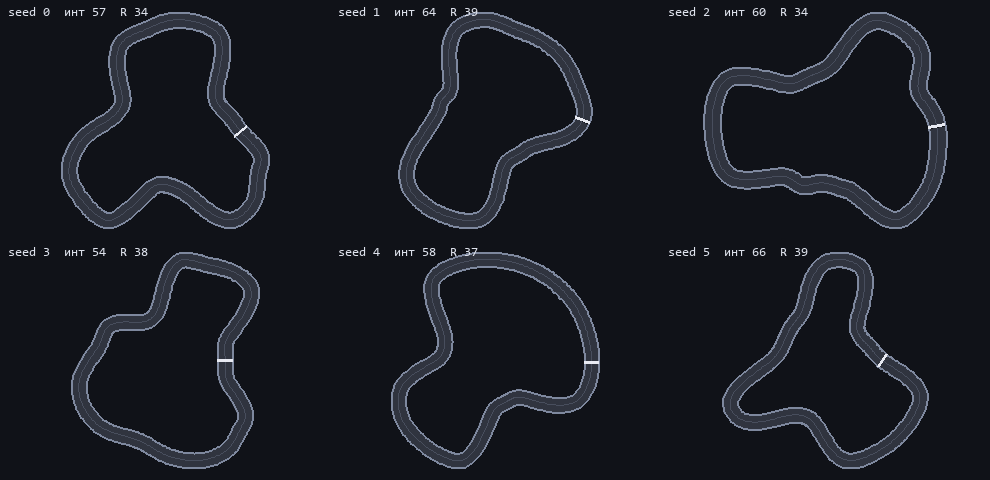
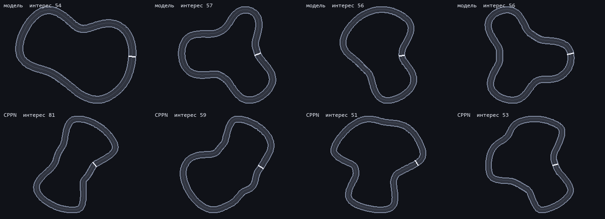
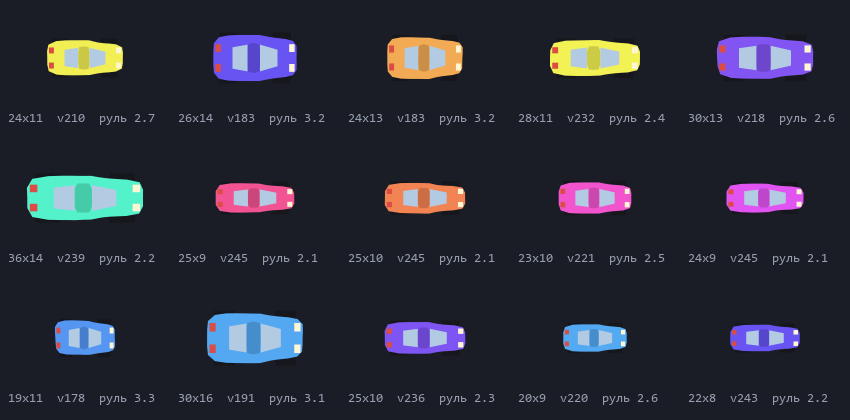
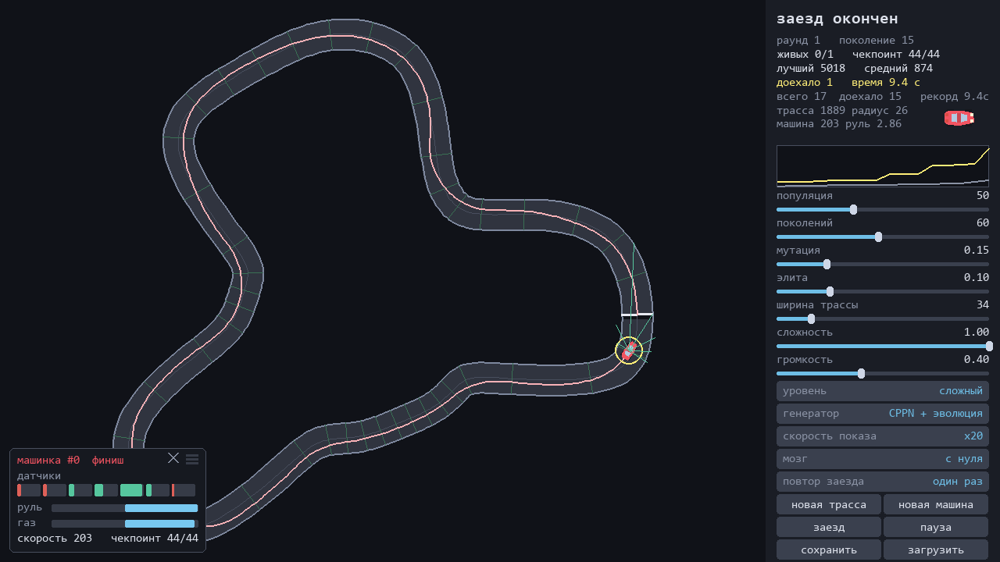

<div align="center">

# AI Car Racing

**Игра-песочница, где всё генерируется и всему учатся нейросети: одна рисует трассу, вторая - машинку, пятьдесят третьих учатся её проезжать эволюцией, прямо на глазах.**

[Скачать для Windows](https://github.com/ALEXalesha/AiCar/releases/latest) &nbsp;·&nbsp; [English version of this file](README.md)

[](https://github.com/ALEXalesha/AiCar/actions/workflows/ci.yml)
[](https://github.com/ALEXalesha/AiCar/releases/latest)
[](LICENSE)



</div>

Игра-песочница, где всё генерируется и всему учатся нейросети.

Каждый раунд идёт по трём шагам:

1. Сеть рисует гоночную трассу, отбор оставляет лучшую из двухсот.
2. Сеть рисует машинку, из её формы выводятся масса, скорость и поворотливость.
3. Пятьдесят нейросетей-водителей учатся проезжать эту трассу от старта до финиша. Учатся эволюцией, прямо на глазах.

Раунды запускаются по кругу, каждый раз с новой трассой и новой машинкой.

Слева трасса и все пятьдесят машинок. Живые цветные, разбившиеся остаются лежать серыми, и по их скоплению сразу видно, в каком повороте гибнет поколение.

Клик по любой машинке включает слежение за ней: жёлтое кольцо, лучи её датчиков и панель телеметрии с показаниями всех семи датчиков, положением руля и газа. Когда машинка разбивается, слежение само переходит на ближайшую живую. Панель телеметрии перетаскивается мышью.

Справа панель со статистикой, графиком обучения и настройками.

С версии 2.0.0 окно на Qt (PySide6) вместо pygame: всё рисуется со сглаживанием и при этом быстрее прежнего, окно можно тянуть и разворачивать, а открывается игра меню - «Играть», «Статистика», «Настройки», «Выход».

## Запуск

### Готовая сборка для Windows

В разделе релизов лежат два файла, оба ничего не требуют от системы: Python, numpy и Qt упакованы внутрь.

- `AiCar-<версия>-portable.zip` (39 МБ): распаковать и запустить `AiCar.exe`. Сохранения, статистика, настройки и место окна пишутся в папку рядом, на компьютере ничего не остаётся
- `AiCar-<версия>-setup.exe` (28 МБ): установщик с ярлыками и деинсталлятором. Прав администратора не просит, ставится в профиль пользователя

Собрать самому:

```
pip install pyinstaller pillow
python build.py
```

### Из исходников

Нужны Python 3.11 или новее, numpy и PySide6.

```
pip install numpy PySide6
python main.py
```

Обучение без графики, в консоли:

```
python train.py --seed 3 --generations 60
```

```
трасса: длина 2070, самый крутой поворот 34, чекпоинтов 45, построена за 1.9 с
машинка: скорость 171, руль 3.39, масса 2.48, габариты 22 на 22

поколение   0  лучший    142.9  средний     45.9  чекпоинтов   1/44  выжило   0
поколение   1  лучший    153.4  средний     59.1  чекпоинтов   1/44  выжило   0
поколение   2  лучший   1374.1  средний    199.1  чекпоинтов  13/44  выжило   0
поколение   5  лучший   4700.0  средний    358.2  чекпоинтов  44/44  выжило   0  ФИНИШ x1 за 20.0 с
```

## Управление

| Клавиша | Действие |
|---|---|
| R | новая трасса и новая машинка |
| T | новая трасса, машинка прежняя |
| S | показательный заезд лучшего мозга |
| L | вернуть слежение на лидера |
| N | не следить ни за кем |
| клик по машинке | следить за ней |
| клик по пустому асфальту | выключить слежение |
| 1 2 3 4 | скорость (показа): x1, x5, x20, без отрисовки |
| пробел | пауза |
| Esc | в меню (до 2.0.0 - выход) |

Буквы работают и на русской раскладке: игра смотрит на физическую клавишу, а не на букву.

То же самое доступно кнопками. Ползунками задаются размер популяции, число поколений, сила мутации, доля элиты, ширина трассы, сложность и громкость. Все ползунки и переключатели с 2.0.0 переживают перезапуск: они пишутся в `settings.json` рядом с сохранениями. Сообщения игры («мозг загружен, обучение начато заново» и другие) всплывают над трассой целиком - раньше длинные обрезались многоточием в строке панели.

Переключатель `уровень` двигает ширину и сложность сразу: `лёгкий`, `обычный`, `сложный`, `адский`. По умолчанию `сложный`: по замеру на двенадцати сидах доезжают десять, в среднем за 16 поколений, и ни один случайный мозг не проезжает круг сразу.

Переключатель `повтор заезда` решает, что делать после обучения: показать заезд победителя один раз, крутить его по кругу или не показывать вовсе.

Кнопки `сохранить` и `загрузить` работают с мозгами: сохранённую популяцию можно поднять в следующем запуске игры. Мозги, сохранённые версией 1.1.0, загружаются и в 2.0.0.

Кнопки `в меню` и `статистика` - на панели внизу. Пока открыто меню или статистика, обучение стоит и ждёт.

## Меню, статистика, настройки

Окно открывается меню: картинка из самой игры, название, несколько строк о том, что это за проект, и четыре кнопки. «Играть» в первый раз строит трассу, дальше продолжает ту же игру.



**Статистика** - по образцу Нейро-змейки: всё, что игра копит в `stats.json`.

- Сверху карточки с крупными числами: раундов сыграно, доехали до финиша (и доля), поколений обучено, рекорд круга.
- Ниже на всю ширину - главный график: как учились водители последнего раунда, поколение за поколением. Жёлтая линия - лучший в поколении, серая - средний, в углу последние значения обеих, деления и подписи обеих осей. Пока раунд идёт, график показывает его; пока ни одного раунда не было, вместо пустого графика сказано, когда он появится.
- Три графика по раундам: сколько поколений ушло до финиша, время финиша, какую долю трассы проехал лучший.
- Таблицы по уровням и по генераторам трассы (интерес и время на трассу - как таблица ниже в этом файле, только по своим раундам), сравнение с замером автора на уровне `сложный` (зелёным - не хуже замера), какие машинки доезжают, а какие нет.



`stats.json` версии 1.1.0 читается: общие счётчики и график «поколений до финиша» видны сразу, а подробности по каждому раунду (уровень, генератор, трасса, машинка, кривая обучения) записываются с 2.0.0 - экран так и пишет, сколько раундов было до этого.

**Настройки** - те же значения, что на панели (громкость, уровень, генератор трассы, популяция, поколений, скорость показа, повтор заезда), только крупно и с пояснениями; меняют панель сразу.



## Три сети

Название игры не преувеличение: нейросетей здесь действительно три, и они делают совсем разные вещи.

### 1. Сеть рисует трассу

Обычно "нейросеть генерирует картинки" означает, что её обучили на тысячах примеров. Датасета гоночных трасс у нас нет, и собирать его это отдельный проект на недели.

Поэтому используется CPPN, сеть, порождающая узоры. Её веса не обучают, а берут случайными. Из-за того, что внутри сидят синусы, гауссианы и вейвлеты, случайные веса дают не шум, а органичные формы.

Устроено так: сеть получает угол θ и возвращает радиус r(θ). Углы пробегают полный круг, точки складываются в замкнутую петлю.

Ключевая деталь: на вход подаётся не сам угол, а его гармоники `sin θ, cos θ, sin 2θ, cos 2θ, sin 3θ, cos 3θ`. Все они имеют период 2π, поэтому при θ=0 и θ=2π вход одинаков, значит и радиус одинаков, значит кривая замкнута по построению. Подай мы угол напрямую, концы бы не сошлись.

Веса такой сети, 209 чисел, это и есть ген трассы. Такие гены можно скрещивать и мутировать, чем и занимается отбор: 200 вариантов, 15 поколений, награда за разнообразие формы и штраф за непроходимые повороты. Две секунды на трассу.



#### Второй генератор: обученная модель

В панели есть переключатель `генератор`. Второй пункт это уже настоящая обученная модель, вариационный автокодировщик.

Работает это так. Каждая трасса у нас представима как 360 радиусов, то есть вектор фиксированной длины. На таких данных модель обучается легко. Датасет собран своим же CPPN: 400 независимых прогонов эволюции, из каждого забираются все хорошие особи поздних поколений, итого 5000 трасс. Дальше VAE учится сжимать профиль в 12 чисел и восстанавливать обратно, а генерация это просто случайная точка в этом 12-мерном пространстве.

| Способ | Интерес (медиана) | Время на трассу |
|---|---|---|
| CPPN + эволюция | 59.3 | 2243 мс |
| Обученная модель | 59.9 | 48 мс |

Качество то же, скорость в 47 раз выше: модель не ищет форму перебором, она её помнит.



Сверху трассы модели, снизу эволюции. У модели формы чуть глаже, у CPPN острее.

Обучение идёт на PyTorch отдельным скриптом, но **играть можно без torch**: в репозиторий положен файл весов декодера на 498 килобайт, а сам декодер это три матричных умножения на numpy.

### 2. Сеть рисует машинку

Такая же CPPN, но она не рисует кузов с нуля, а лепит его поверх каркаса машины: скруглённого прямоугольника с сужением к носу. Колёса и лобовое стекло строятся от габаритов кузова.

Физика выводится из формы, а не задаётся отдельным рандомом:

- площадь силуэта даёт массу
- вытянутость даёт максимальную скорость и остроту руля: длинная узкая машина быстрее, но хуже вписывается в поворот



### 3. Сеть ведёт машину

Вот это уже обучение.

Машинка видит мир семью лучами-датчиками, как лидаром: расстояние до стены под углами от -90 до +90 градусов. Плюс собственная скорость. Итого восемь чисел.

```
8 входов  ->  10 нейронов (tanh)  ->  2 выхода: руль и газ
```

Весов ровно 112. Больше сеть не знает ничего: ни где она на трассе, ни куда ехать, ни где финиш.

**Как она учится.** Правильных ответов вида "здесь надо повернуть на 15 градусов" у нас нет, есть только оценка в конце заезда. Это задача обучения с подкреплением, и решается она здесь генетическим алгоритмом.

Пятьдесят машинок с разными весами едут одновременно. Кто проехал дальше, тот оставляет потомство: гены двух родителей смешиваются, результат слегка мутирует. Десять процентов лучших переходят в следующее поколение без изменений, чтобы найденное решение не потерялось из-за неудачной мутации.

**Приспособленность** считается по чекпоинтам, расставленным вдоль трассы через каждые 45 пикселей:

```
оценка = (взятые чекпоинты + доля пути до следующего) * 100
       + если доехала: (1800 - шаг финиша) * 0.5
```

Это самое хрупкое место всего проекта, куда более хрупкое, чем сама сеть. Считать просто пройденное расстояние нельзя: машинки научатся крутиться на месте. Считать расстояние по прямой от старта нельзя: застрянут в первом повороте. Чекпоинты засчитывают только движение в правильную сторону.

Ровно тот же принцип, что в reward hacking у больших моделей: агент оптимизирует ту метрику, которую вы написали, а не ту, которую имели в виду.



## Как это выглядит в цифрах

Замер по двенадцати случайным сидам на уровне `сложный`: доезжают десять из двенадцати, медиана 16.5 поколений, и ни у одного случайный мозг не проезжает круг сразу. Одно поколение без графики считается за 0.27 секунды.

График обучения почти всегда одинаковой формы: долгое плато, потом резкий скачок. Так работает эволюция, она не улучшает решение понемногу, а ждёт удачной мутации, открывающей следующий кусок трассы.

## Почему всё считается быстро

Пятьдесят машинок это не пятьдесят объектов, а массивы формы `(50, ...)`. Физика, датчики и прогон сетей считаются для всего поколения сразу, без единого цикла по машинкам. В коде физики нет ни одного `if`: мёртвые машинки замораживаются умножением на булеву маску.

Отдельная история с датчиками. В лоб это 50 машинок на 7 лучей на 720 отрезков стены, то есть 252 тысячи проверок пересечения за один шаг физики, и 450 миллионов за поколение. Вместо этого один раз на трассу строится сетка расстояний до стен, и луч не пересекает ничего, а просто шагает по ней и смотрит значения. Та же сетка бесплатно даёт проверку столкновений.

### Отрисовка: Qt со сглаживанием быстрее pygame без него

С 2.0.0 рисует `QPainter` со сглаживанием. Сглаживание дороже, поэтому дорогое рисуется один раз:

- трасса (лента из 720 точек и три замкнутые линии) рисуется в картинку и дальше только копируется, пока не сменились трасса или размер поля;
- машинка - многоугольники в её собственных координатах, построенные один раз; на экран каждую ставит одна матрица (поворот, масштаб, переворот оси Y, сдвиг), а не пересчёт точек; четыре колеса, два стекла и пары фар слиты в один путь, и деталей рисуется шесть вместо двенадцати;
- виджеты панели рисуются в картинку, которая перерисовывается только когда в них что-то сменилось (значение, наведение мыши, размер).

Замер - `tools/bench_frame.py`, тот же сценарий, что мерил pygame-версию: трасса, 50 машинок (десять разбиты), слежение за лидером с лучами и телеметрией, панель со статистикой и графиком; одна машина, одна нагрузка.

| | кадр, среднее |
|---|---|
| pygame 1.1.0, в память | 5.7-6.9 мс |
| pygame 1.1.0, настоящее окно с `flip` | 5.6-7.4 мс |
| **Qt 2.0.0**, в память, со сглаживанием | **3.4 мс** |
| **Qt 2.0.0**, настоящее окно: `paintEvent` / вместе с выводом на экран | **3.2 / 3.7 мс** |

Цикл - `QTimer` с точным ходом и счётом кадров по часам: логика идёт ровно 60 кадров в секунду, как у pygame с `clock.tick(60)`.

Звук - тот же синтез на numpy, играет через `QAudioSink`. Мотор - двенадцать петель разной высоты, и при смене оборотов старая петля затухает, пока нарастает новая (у pygame была обрезка); удар и финиш смешиваются поверх. Без звуковой карты игра молчит и не падает.

## Устройство проекта

Все модули лежат в корне, каждый с подробным документом в `docs/modules/`.

| Модуль | Ответственность | Документ |
|---|---|---|
| `config.py` | все константы проекта | [config.md](docs/modules/config.md) |
| `cppn.py` | замкнутые формы из случайных весов | [cppn.md](docs/modules/cppn.md) |
| `evolution.py` | отбор, скрещивание, мутация, элита | [evolution.md](docs/modules/evolution.md) |
| `track.py` | геометрия и эволюция трассы | [track.md](docs/modules/track.md) |
| `trackgen.py` | генерация трассы обученной моделью | [trackgen.md](docs/modules/trackgen.md) |
| `dataset.py` | сбор датасета трасс для обучения | [dataset.md](docs/modules/dataset.md) |
| `train_generator.py` | обучение VAE, единственное место с torch | [train_generator.md](docs/modules/train_generator.md) |
| `field.py` | поле расстояний до стен | [field.md](docs/modules/field.md) |
| `car.py` | форма и физические параметры машинки | [car.md](docs/modules/car.md) |
| `sensors.py` | лучи-датчики | [sensors.md](docs/modules/sensors.md) |
| `brain.py` | сеть-водитель | [brain.md](docs/modules/brain.md) |
| `race.py` | физика заезда, чекпоинты, приспособленность | [race.md](docs/modules/race.md) |
| `train.py` | обучение без графики и запуск из консоли | [train.md](docs/modules/train.md) |
| `render.py` | камера и отрисовка через QPainter | [render.md](docs/modules/render.md) |
| `ui.py` | панель: ползунки, кнопки, график, раскладка по высоте окна | [ui.md](docs/modules/ui.md) |
| `sound.py` | синтез звука, микшер, вывод через QAudioSink | [sound.md](docs/modules/sound.md) |
| `stats.py` | сохранение мозгов и статистики | [stats.md](docs/modules/stats.md) |
| `paths.py` | где лежат ресурсы и где сохранения | [paths.md](docs/modules/paths.md) |
| `main.py` | игра без окна: раунды, поколения, рисование кадра; самопроверка | [main.md](docs/modules/main.md) |
| `window.py` | окно Qt: экраны, цикл на таймере, мышь, клавиши, сообщения | [window.md](docs/modules/window.md) |
| `screens.py` | меню и настройки | [screens.md](docs/modules/screens.md) |
| `stats_screen.py`, `chart.py` | экран статистики и графики на нём | [stats_screen.md](docs/modules/stats_screen.md) |
| `theme.py` | тёмная тема экранов (QSS) | [screens.md](docs/modules/screens.md) |
| `prefs.py` | настройки панели между запусками | [screens.md](docs/modules/screens.md) |
| `window_state.py` | место окна между запусками | [window_state.md](docs/modules/window_state.md) |
| `rect.py` | прямоугольник с правилами pygame | [rect.md](docs/modules/rect.md) |
| `offscreen.py` | Qt без экрана со шрифтами Windows | [window.md](docs/modules/window.md) |
| `build.py` | сборка portable-версии и установщика | [build.md](docs/modules/build.md) |
| `stress.py` | проверка инвариантов случайными данными | [stress.md](docs/modules/stress.md) |

Документы модулей это не пересказ кода. В каждом написано, почему сделано именно так, какая математика за этим стоит и на какие грабли уже наступили.

Спецификация и планы: [docs/superpowers/](docs/superpowers/) (перевод на Qt - [2026-09-26-aicar-qt.md](docs/superpowers/plans/2026-09-26-aicar-qt.md)). История изменений - [CHANGELOG.md](CHANGELOG.md).

## Тесты

```
python -m pytest -q
```

446 тестов, две с небольшим минуты. Логика игры - геометрия трассы, поле расстояний, датчики, физика, чекпоинты, приспособленность, генетический алгоритм, синтез звука и микшер, сохранения - и окно: Qt без экрана (`QT_QPA_PLATFORM=offscreen`, шрифты Windows через `QT_QPA_FONTDIR`), одно `QApplication` на весь прогон, без pytest-qt. Мышь и клавиши - через `QTest`, картинка - попиксельно из `QImage`.

Законы окна, в том числе из других Qt-игр автора:

- подпись с переносом строк не ограничена по высоте и целиком помещается в окне минимального размера, даже если текст на 10% шире (так на настоящем экране бывает шире, чем в offscreen); то же для подписей ползунков и переключателей панели, которые мерит `QFontMetrics`;
- окно влезает в экран 1024x768; при любом размере поле и панель делят окно без щели и наложения, виджеты панели не наезжают друг на друга;
- строка итогов после обрезки не шире панели, телеметрия не красит ни пикселя за своим окошком, поле не красит панель.

Сохранения, статистика и место окна, записанные версией 1.1.0, проверяются на файлах, которые записал сам код 1.1.0. Один тест открывает настоящее окно дважды: окно игры открывается там, где его закрыли (`window.json` в папке данных), и проверить это можно только у самой Windows.

Каждый новый закон прогнан по намеренно сломанной версии, и каждая поломка поймана: поле без обрезки, рамка телеметрии на полпикселя наружу, сообщение с высотой в одну строку, минимум окна 1280x720, файл окна 1.1.0 без перевода, подпись меню с шириной и выравниванием по центру, график без последнего поколения, мотор без перекрёстного затухания, ошибка звука, сравнённая не с тем перечислением, настройки, которые не берегут ширину от смены уровня.

Кроме тестов есть массовая проверка инвариантов случайными данными:

```
python stress.py --rounds 10
```

101 свойство, которые обязаны выполняться при любых входных данных, каждое прогоняется сотнями раз на случайных входах: 9211 проверок на круг, один круг - около 80 секунд; на сервере сборки после каждого пуша прогоняется один круг вместе с тестами. Три из них гоняют настоящую игру сотни кадров подряд, случайно нажимая клавиши и кнопки, таская мышь и меняя размер окна, и сверяют инварианты после каждого кадра. Тест стережёт придуманный автором сценарий, свойство стережёт договор целиком. Устройство разобрано в [docs/modules/stress.md](docs/modules/stress.md), находки в отчёте о проверке на баги. Ключ `-k` оставляет только свойства с этим текстом в имени - так удобно прогонять их по сломанной версии.

Собранная версия проверяется отдельно, ключом `--selftest`: игра прогоняет полный раунд через настоящее окно, только без экрана (offscreen), рисует меню, статистику и настройки, открывает звуковую карту без звука и пишет отчёт в файл: откуда запущена, найдена ли модель, открылся ли звук и в каком формате, какой шрифт, сколько поколений и лучший результат, время кадра. Результат обязан совпасть с запуском из исходников до единицы. Сохранения игрока при этом не трогаются: запись уводится во временную папку.

Отдельный отчёт о проверке на баги, с профилированием и краевыми случаями: [docs/bug-hunt.md](docs/bug-hunt.md).

## Чему научил проект

Три находки, которые стоили больше всего времени, и все три нашлись замером или картинкой, а не рассуждением.

**Метрика поощряла не то.** Награда за разброс кривизны звучит разумно, а на деле разброс дешевле всего набрать, оставив трассу окружностью и добавив пару резких вмятин. Рукотворный трилистник получал по этой метрике 8.2, а круги с вмятинами 12-13. Метрику пришлось заменить на крупномасштабную.

**Рассуждение дало обратный ответ.** Разброс весов CPPN стоял 1.5 по логике "больше весов, больше нелинейности, больше разнообразия". Замер показал, что при 1.5 насыщены 54 процента выходов, радиус выходит прямоугольной волной, и после сглаживания получаются круги. При 0.5 разброс формы вырос в шестнадцать раз.

**Картинка увидела то, чего не видели тесты.** Все трассы подряд имели дефект ровно на линии старта. Причина: активация `np.abs` имеет излом в нуле, а `sin θ` обращается в ноль ровно при θ=0 и θ=π.

## Пересобрать модель самому

Если хочется свой датасет или другие настройки:

```
pip install torch
python dataset.py --runs 400 --keep 5000 --min-interest 35
python train_generator.py --epochs 400
```

Первая команда собирает 5000 профилей трасс за пять минут, вторая обучает модель за полторы минуты на видеокарте и сама проверяет, что получилось.

## Кадры для README собираются программой

`tools/make_previews.py` запускает игру без окна на экране - тем же способом, что и её собственная самопроверка: Qt с платформой offscreen рисует в картинку в памяти, шрифты берёт из папки Windows, кадр снимается с окна (`widget.grab()`) или с той же отрисовки игры. Все кадры этого файла - игра, заезд, меню, статистика, настройки, панель, трассы, генераторы, машинки - собирает один этот скрипт.

```bash
python tools\make_previews.py
```

Снимок экрана тут не годится дважды. Окно может оказаться позади других, и в кадр попадёт чужое содержимое. А главное - нужный момент руками не поймать: кадр «часть поколения уже лежит серыми в одном повороте» живёт доли секунды. Скрипт ищет его по состоянию гонки, а не по номеру кадра, и с постоянным зерном повторяется от прогона к прогону. Статистика на кадре - из раундов, которые скрипт сыграл сам во временной папке, а не личная.

## Лицензия

MIT, файл [LICENSE](LICENSE).
